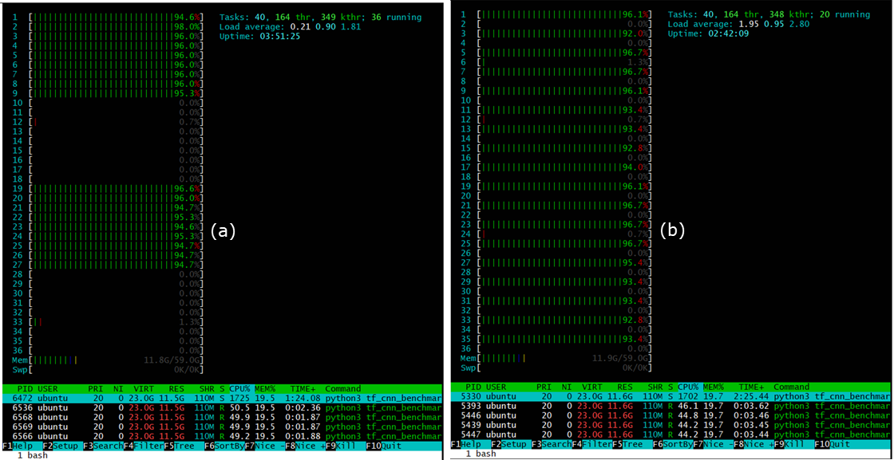
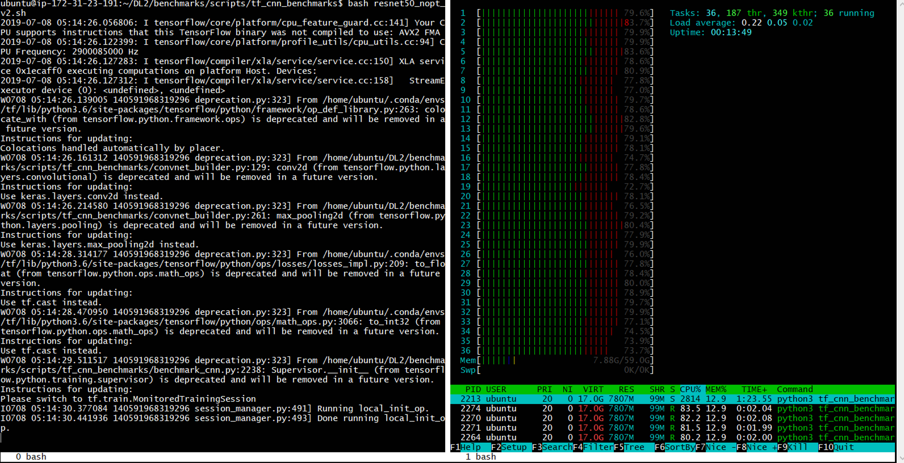
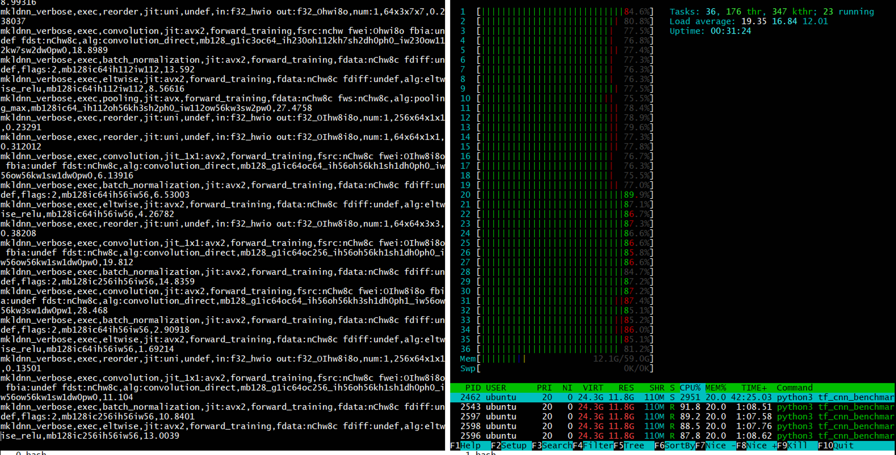
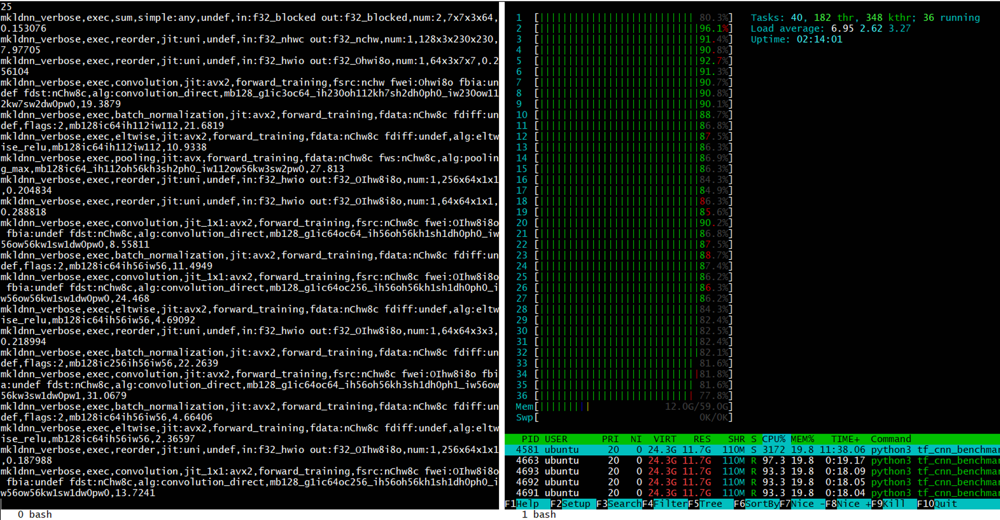
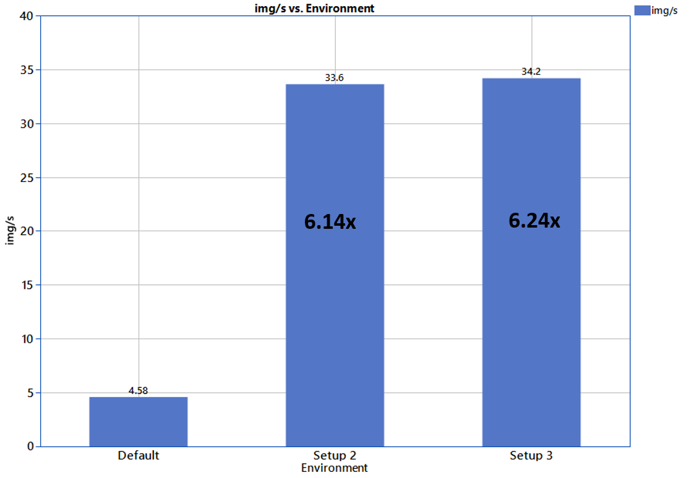

## 6x training speedup using intel-tensorflow, OMP-settings and numactl interleave policy optimization

This is a quick tryout to optimize training performance on CPU using intel tensorflow, KMP affinity settings and numactl policies on an AWS instance and compare speedup on training performance.

Below is a walk through of the steps to get the results and a sample bash script can be found at resnet50_train_optimize.sh file.

## Connecting to AWS and installing the dependencies

#### Setup the AWS environment
1. Launch instances by following EC2 tutorial: [Launch a Linux Virtual Machine
with Amazon EC2](https://aws.amazon.com/getting-started/tutorials/launch-a-virtual-machine/#)

2. Confirm _htop_ is already installed in the ubuntu server (I found it already installed): ```$ htop```


3. Python 3.6.7 was already istalled

4. Numactl can be installed by:
   - ```$ Sudo apt install numactl```
   - Confirm installation: ```$ numactl```

5. Install anaconda:
   - ```$ wget http://repo.continuum.io/archive/Anaconda3-4.1.1-Linux-x86_64.sh```, it's a big file, might take a while depending on internet speed
   - install once download complete: ```$ sudo bash Anaconda3-4.1.1-Linux-x86_64.sh```
   - Further optimize the conda configurations to set default port for jupyter notebook etc. can be found in this nice article:
[Getting Spark, Python, and Jupyter Notebook running on Amazon EC2](https://medium.com/@josemarcialportilla/getting-spark-python-and-jupyter-notebook-running-on-amazon-ec2-dec599e1c297)

#### Install tensorflow without optimization

1. confirm python 3.6 is installed: ```$ python3```

2. Update all pkgs and environments: ```$ sudo apt update```

3. Install tensorflow in a new environment called _tf_ to make life easier later: ```$ conda create -n tf tensorflow```, this installs the default CPU version
   - confirm the version of tensorflow after installation:
     - activate the new environment: 
     ```sh
     $ source activate tf
     ```
     - check the tensorflow version: 
     ```sh
     $ python3 -c “import tensorflow as tf; print(tf.__version__)”
     ```

#### Install intel optimized tensorflow

Install intel distribution for python by: 
```shell
$conda create -n IDP intelpython3_full -c intel
```

#### Download the tf_cnn_benchmarks 

The code below can be used to get the tf_cnn_benchmarks files.
```

$ git clone -b cnn_tf_v1.12_compatible  https://github.com/tensorflow/benchmarks.git

``` 
More details can be found here: [tf_cnn_benchmarks: High performance benchmarks](https://github.com/tensorflow/benchmarks/tree/master/scripts/tf_cnn_benchmarks)   

## Configuration

A single node on an Intel® Xeon® CPU E5-2666 v3 @ 2.90GHz with 18 physical cores with 2 threads per core and 60 GB of RAM* was used. This node was accessed via a c4.8xLarge AWS instance with 2 Numa Nodes available. 

tf_cnn_benchmarks: High performance benchmarks was used for the test. ResNet-50 model with synthetic data and batch size of 128 and 30 batches was trained with different settings as detailed below. 

\*Note: the size of the RAM was not a constraint in this experiment

## Setup

The environmental and tensorflow settings can be setup using a bash script that activates the desired environment, sets the MPI settings and calls the _tf_cnn_benchmarks.py_ with the desired flags. This will ensure consistency and makes it easier to tweak parameters later.

First, Download the benchmark files as noted above. For simplicity, save the bash the script in the same directory as the _tf_cnn_benchmarks.py_ file. The _MKL_VERBOSE_ and _MKLDNN_VERBOSE_ are set to 1 in order to output when MKL is used for computation. This is one way of confirming that intel optimized Math Kernel Libraries are being used for computations.

```sh
$ export MKL_VERBOSE=1
$ export MKLDNN_VERBOSE=1
```

#### Setup 1 (Default environment - no optimization)

The code below will activate the unoptimized tensorflow environtment _tf_ and will call the _tf_cnn_benchmarks.py_ script with flags to run on CPU with synthetic imagenet data of batch_size 128 and 30 batches. Data format is set to NHWC (Channels_last)
``` shell
$ source activate tf
$ python3 tf_cnn_benchmarks.py \
	 --device=CPU \
	 --data_name=imagenet \
	 --batch_size=128 \
	 --num_batches=30 \
	 --model=resnet50 \
	 --data_format=NHWC \
	 2>&1 | tee default.log 
$ source deactivate
```

#### Setup 2 (optimized tf.config_proto() and MKL=True in intel python environment)

```sh
$ source activate IDP
#set environment settings (these are recommended settings based on some read, 
#resources mentioned in the resources section at the end)
$ export KMP_AFFINITY=granularity=fine,verbose,compact,1,0
$ export KMP_BLOCKTIME=1
$ export KMP_SETTINGS=1
$ export OMP_NUM_THREADS=18
#run the python code with config update
$ python3 tf_cnn_benchmarks.py \
	 --device=CPU \
	 --data_name=imagenet \
     	 --batch_size=128 \
	 --num_batches=30 \
	 --model=resnet50 \
	 --data_format=NHWC \
	 --mkl=true \
	 --num_inter_threads=2 \
	 --num_intra_threads=18 \
	 2>&1 | tee optimized1.log
```

#### Setup 3 (Applying numa interleave policy on top of setup 2)
```sh
$ numactl -i all python3 tf_cnn_benchmarks.py \
	 --device=CPU \
	 --data_name=imagenet \
     	 --batch_size=128 \
	 --num_batches=30 \
	 --model=resnet50 \
	 --data_format=NCHW \
	 --mkl=true \
	 --num_inter_threads=2 \
	 --num_intra_threads=18 \
	 2>&1 | tee optimized2.log #sends the stderror to where stdoutput is going and 
	 			   #then tee combines both and sends to display and the log file
```
## Playing with NUMA Scheduling Policy settings

The CPU used for this project had 2 NUMA nodes available as can be seen from ```$ lscpu```:
```sh
NUMA node0 CPU(s):   0-8, 18-26
NUMA node1 CPU(s):   9-17, 27-35
```
NUMACTL gives the ability to control the NUMA scheduling policy and memory placement policy, concretely, which cores to use to run the tasks and where to allocate data. It can be installed by, “$ Sudo apt install numactl”.  The default policy can be seen by “numactl –s” and the HW configuration including memory size, free memory and node distances can be seen by “numactl –H” commands as shown below for this specific CPU:
```sh
$ numactl -s
```
```
#output:
policy: default
preferred node: current
physcpubind: 0 1 2 3 4 5 6 7 8 9 10 11 12 13 14 15 16 17 18 19 20 21 22 23 24 25 26 27 28 29 30 31 32 33 34 35
cpubind: 0 1
nodebind: 0 1
membind: 0 1
```
```sh
$ numactl -H
```
```
#output:
available: 2 nodes (0-1)
node 0 cpus: 0 1 2 3 4 5 6 7 8 18 19 20 21 22 23 24 25 26
node 0 size: 30143 MB
node 0 free: 29281 MB
node 1 cpus: 9 10 11 12 13 14 15 16 17 27 28 29 30 31 32 33 34 35
node 1 size: 30226 MB
node 1 free: 29980 MB
node distances:
node   0   1
  0:  10  20
  1:  20  10
```
Binding memory to node 1 by “numactl –p” or “numactl –m” resulted in reduced performance, both resulting in ~23.6 images/sec. reducing # of CPU threads or cores/nodes resulted in linearly decreasing performance which indicates this particular algorithm is more CPU bound than memory bound and should be scalable by increasing CPU cores. Htop can be used to verify the result of using different CPU binding as shown in the image below.


**Fig1:** Achieving CPU core distribution using numactl, (a) bind to node 0 only, using “numactl –C 0” and (b) Use only 1 thread from all available cores using “numactl –C 0,2,4….etc” note, both these settings resulted in lowering in performance for this algorithm, but might be useful for memory bound problems

## Results

htop was used to monitor the load distribution during the training and the difference can be seen on how many idle threads are present in the default settings against when the environment variables are optimized.

  
**Fig2:** _(setup1:no optimization)_ – _htop_ (right) showing the load distribution on the threads of the CPU and on Memory, Red represents idle or ‘waiting’ thread, while training (left)


**Fig3:** _(setup2: intel optimized tensorflow and affinity settings optimized)_ - MKLDNN_VERBOSE is displaying the operation performed (left), the number of red threads are lower then setup 1, indicates CPU threads are not waiting for data


**Fig4:** _(setup3: intel optimized tensorflow and affinity settings optimized with numactl interleave policy)_ the number of red threads are less than setup 1 and similar or better than setup 2

The default setup trained 30 batches with an average of 5.48 images/sec. While setup 2 returned an average of 33.62 images/sec, which is 6.14x performance increase compared to the un-optimized settings.

Binding memory to node 1 by “numactl –p” or “numactl –m” resulted in reduced performance, both resulting in ~23.6 images/sec. reducing # of CPU threads or cores/nodes resulted in linearly decreasing performance which indicates this particular algorithm is more CPU bound than memory bound and should be scalable by increasing CPU cores. Htop can be used to verify the result of using different CPU binding as shown in Fig1. 

It was observed that for this algorithm the memory interleave policy on all nodes returned the best performance and in fact showed better performance than setup2. “numactl –i all”, allows the memory to be allocated using round robin on nodes. When memory cannot be allocated on the current interleave target fall back to other nodes as mentioned in https://linux.die.net/man/8/numactl page. This settings along with setup 2 settings performed 34.18 images/sec, which is 6.24x increase in performance from the setup1.

Below is a comparison of the top 3 setups performance:


**Fig5:**  performance comparison of the three setups discussed in this article

## Wrap Up

It was seen that the training performance on a CPU can be improved by upto 6.24x by optimizing the environment settings, tensorflow inter and intra thread parallelization settings and numactl memory allocation settings. Different numactl settings can be used to decide whether a problem is memory bound or CPU bound. For a CPU bound problem, using interleave memory policy worked best, but for memory bound problems, local or memory binding on nearest node and reducing no of cores to use might work better as illustrated in this whitepaper from intel, [Accelerating memory-bound machine-learning models on intel xeon processors](https://www.intel.ai/solutions/accelerating-memory-bound-machine-learning-models-on-intel-xeon-processors).

Most of the recommendation found for optimizations are found by trial and error, so it might be different for different algorithms/HW configuration etc. So, it's recommended to start with the best known methods but definitely not to be limited to these values only. A different combination of settings might give a significant boost then the recommended settings, so keep playing!
